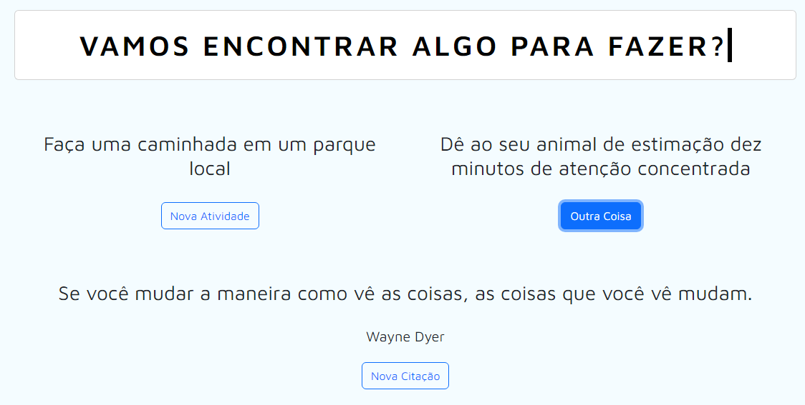

# Random Quote Translator

Este é website bem simples que realiza um request na [Bored API](https://www.boredapi.com/) para retornar uma atividade aleatória que uma pessoa pode praticar/fazer em um momento de tédio.

Além disso, ele busca uma citação aleatória da [API ZenQuotes](https://docs.zenquotes.io/zenquotes-documentation/) e retorna a citação junto com seu autor para trazer alguns segundos de reflexão.

Como recurso extra, traduz as duas respostas para o português usando a API do Google Tradutor. A citação e a atividade traduzidas são exibidas na página inicial.

- **English version [here](/en-us/README.md).**

## Pré-requisitos

- Node.js (v12 or higher)
- Google Translate API key

## Iniciando o projeto

1. Clone este repositório:

```shell
git clone https://github.com/onativo/imBored.git
```

2. Instale as dependências:

```shell
  cd random-quote-translator
  npm install
```

3.Condifigure a sua API Key do Google Translate:

Acesse sua conta do Google Translate API e salve sua chave.

Insira sua chave secreta no campo `apiKey` do arquivo `/src/scripts.js`.
Você também pode criar um arquivo `config.js` e exportar a apiKey, importando-a novamente no `/src/scripts.js`

4. Inicie o servidor:

```shell
  node index.js
```

5. Abra seu navegador e acesse o link http://localhost:3000 para ver a aplicação rodando.

---

## Licença
Este projeto está licenciado sob a licença MIT.

Sinta-se à vontade para modificar o arquivo README.md conforme necessário para incluir detalhes adicionais ou instruções específicas para o seu projeto.

---

<div align="center">
  
  <sub>Página inicial da aplicação</sub>
</div>